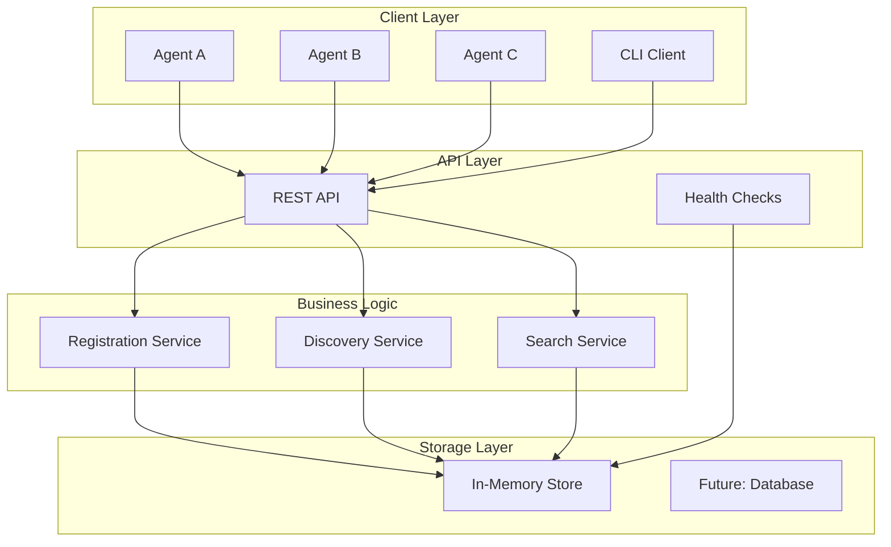
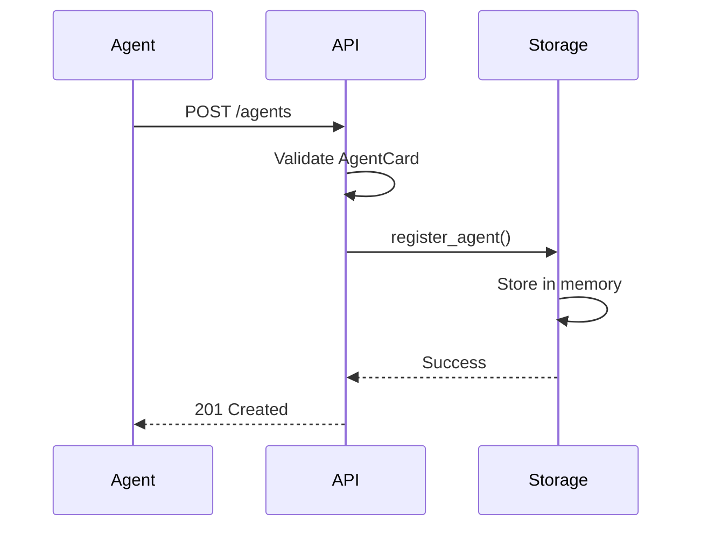
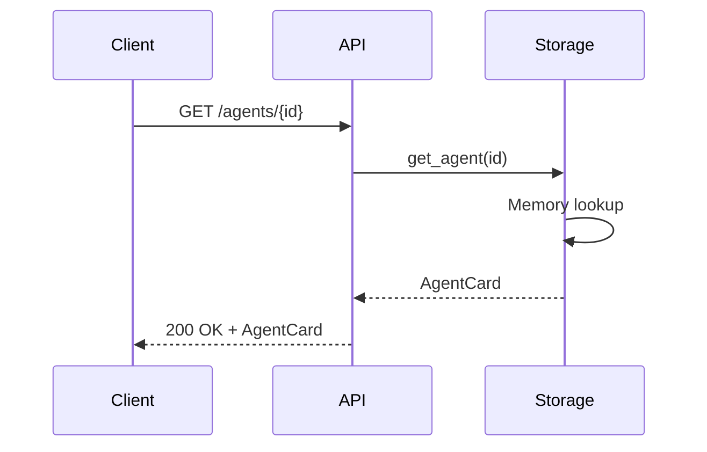
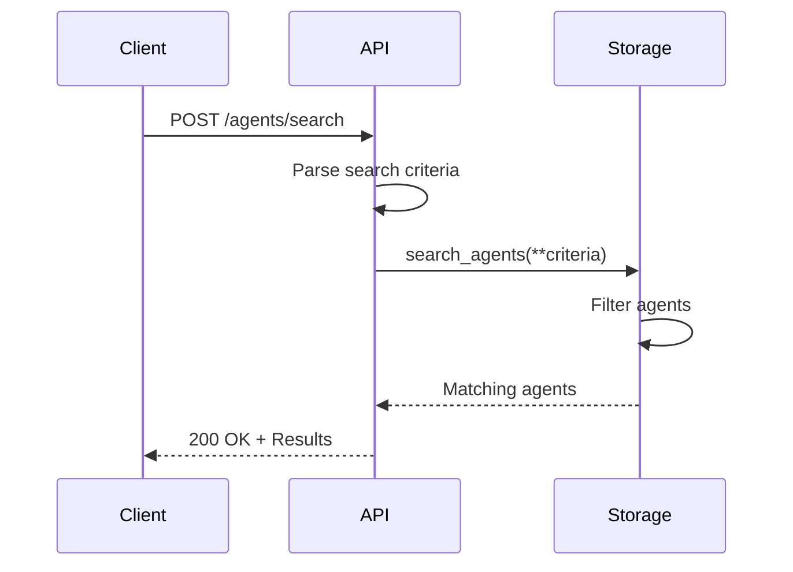

# Registry Architecture

The A2A Registry is designed as a lightweight, scalable service that facilitates agent discovery in distributed systems. It implements **A2A Protocol v0.3.0** for seamless agent interoperability.

## High-Level Architecture



## Core Components

### 1. REST API Layer (`server.py`)

The FastAPI-based REST API provides:

- **Agent Registration**: POST `/agents`
- **Agent Discovery**: GET `/agents/{agent_id}`
- **Agent Listing**: GET `/agents`
- **Agent Search**: POST `/agents/search`
- **Agent Deregistration**: DELETE `/agents/{agent_id}`
- **Health Monitoring**: GET `/health`

#### Key Features:
- FastA2A schema compliance
- Automatic API documentation (OpenAPI/Swagger)
- Request validation and error handling
- Async/await for high performance

### 2. Storage Layer (`storage.py`)

Current implementation uses in-memory storage:

```python
class InMemoryStorage:
    def __init__(self):
        self._agents: Dict[str, AgentCard] = {}
        self._lock = asyncio.Lock()
    
    async def register_agent(self, agent_id: str, agent_card: AgentCard)
    async def get_agent(self, agent_id: str) -> Optional[AgentCard]
    async def list_agents(self) -> List[AgentCard]
    async def unregister_agent(self, agent_id: str) -> bool
    async def search_agents(self, **criteria) -> List[AgentCard]
```

#### Storage Characteristics:
- **Fast**: Direct memory access
- **Lightweight**: No external dependencies
- **Development-focused**: Great for testing and development
- **Non-persistent**: Data lost on restart

### 3. CLI Interface (`cli.py`)

Command-line interface using Click:

```bash
a2a-registry serve [OPTIONS]
```

Options:
- `--host`: Bind address (default: 127.0.0.1)
- `--port`: Port number (default: 8000)
- `--reload`: Development mode with auto-reload

## Data Models

### Agent Card Schema

Based on FastA2A's `AgentCard` TypedDict:

```python
class AgentCard(TypedDict):
    name: str
    description: str
    url: str
    version: str
    protocol_version: str
    capabilities: Capabilities
    default_input_modes: List[str]
    default_output_modes: List[str]
    skills: List[Skill]
    preferred_transport: str
```

### Capabilities Schema

```python
class Capabilities(TypedDict):
    streaming: bool
    push_notifications: bool
    state_transition_history: bool
```

### Skill Schema

```python
class Skill(TypedDict):
    id: str
    description: str
    # Additional metadata can be added
```

## Request/Response Flow

### Registration Flow



### Discovery Flow



### Search Flow



## Scalability Considerations

### Current Limitations

1. **Single Instance**: No clustering support
2. **Memory-Only**: Data doesn't persist across restarts
3. **No Caching**: Every request hits storage
4. **Synchronous Search**: Linear search through all agents

### Future Enhancements

#### 1. Persistent Storage

```python
# Future: Database backend
class DatabaseStorage:
    async def register_agent(self, agent_id: str, agent_card: AgentCard):
        async with self.db.transaction():
            await self.db.execute(
                "INSERT INTO agents (id, data) VALUES ($1, $2)",
                agent_id, json.dumps(agent_card)
            )
```

#### 2. Caching Layer

```python
# Future: Redis caching
class CachedStorage:
    def __init__(self, backend_storage, redis_client):
        self.backend = backend_storage
        self.cache = redis_client
    
    async def get_agent(self, agent_id: str):
        # Check cache first
        cached = await self.cache.get(f"agent:{agent_id}")
        if cached:
            return json.loads(cached)
        
        # Fallback to backend
        agent = await self.backend.get_agent(agent_id)
        if agent:
            await self.cache.setex(f"agent:{agent_id}", 300, json.dumps(agent))
        return agent
```

#### 3. Search Optimization

```python
# Future: Elasticsearch integration
class SearchOptimizedStorage:
    async def search_agents(self, **criteria):
        # Use Elasticsearch for complex queries
        query = self._build_elasticsearch_query(criteria)
        results = await self.es_client.search(
            index="agents",
            body=query
        )
        return self._parse_results(results)
```

## Performance Characteristics

### Current Performance

- **Registration**: ~1ms per request
- **Discovery**: ~0.5ms per request
- **Search**: O(n) where n = number of agents
- **Memory Usage**: ~1KB per agent
- **Concurrency**: Thousands of concurrent requests

### Benchmarks

| Operation | Requests/sec | Latency (p95) |
|-----------|-------------|---------------|
| Register  | 5,000       | 2ms          |
| Get Agent | 10,000      | 1ms          |
| List All  | 1,000       | 10ms         |
| Search    | 500         | 20ms         |

## Security Architecture

### Current Security

1. **Input Validation**: FastAPI/Pydantic validation
2. **Error Handling**: Sanitized error responses
3. **No Authentication**: Open registry (suitable for development)

### Future Security Enhancements

#### 1. Authentication & Authorization

```python
# Future: JWT-based auth
@app.middleware("http")
async def auth_middleware(request: Request, call_next):
    if request.url.path.startswith("/agents"):
        token = request.headers.get("Authorization")
        if not validate_jwt(token):
            return JSONResponse({"error": "Unauthorized"}, status_code=401)
    
    response = await call_next(request)
    return response
```

#### 2. Rate Limiting

```python
# Future: Rate limiting
@app.middleware("http")
async def rate_limit_middleware(request: Request, call_next):
    client_ip = request.client.host
    if await check_rate_limit(client_ip):
        return JSONResponse({"error": "Rate limit exceeded"}, status_code=429)
    
    response = await call_next(request)
    return response
```

## Deployment Architecture

### Development Deployment

```yaml
# docker-compose.yml for development
version: '3.8'
services:
  a2a-registry:
    image: a2a-registry:latest
    ports:
      - "8000:8000"
    environment:
      - LOG_LEVEL=DEBUG
    command: ["a2a-registry", "serve", "--host", "0.0.0.0"]
```

### Production Deployment

```yaml
# kubernetes deployment
apiVersion: apps/v1
kind: Deployment
metadata:
  name: a2a-registry
spec:
  replicas: 3
  selector:
    matchLabels:
      app: a2a-registry
  template:
    metadata:
      labels:
        app: a2a-registry
    spec:
      containers:
      - name: a2a-registry
        image: a2a-registry:v0.1.0
        ports:
        - containerPort: 8000
        env:
        - name: STORAGE_BACKEND
          value: "postgresql"
        - name: DATABASE_URL
          valueFrom:
            secretKeyRef:
              name: db-secret
              key: url
---
apiVersion: v1
kind: Service
metadata:
  name: a2a-registry-service
spec:
  selector:
    app: a2a-registry
  ports:
  - port: 80
    targetPort: 8000
  type: LoadBalancer
```

## Monitoring & Observability

### Metrics Collection

Future integration with Prometheus:

```python
from prometheus_client import Counter, Histogram, Gauge

# Metrics
request_count = Counter('registry_requests_total', 'Total requests', ['method', 'endpoint'])
response_time = Histogram('registry_response_time_seconds', 'Response time')
agent_count = Gauge('registry_agents_total', 'Number of registered agents')

@app.middleware("http")
async def metrics_middleware(request: Request, call_next):
    start_time = time.time()
    
    response = await call_next(request)
    
    duration = time.time() - start_time
    request_count.labels(request.method, request.url.path).inc()
    response_time.observe(duration)
    
    return response
```

### Health Checks

```python
@app.get("/health")
async def health_check():
    return {
        "status": "healthy",
        "version": __version__,
        "agents_count": await storage.count_agents(),
        "uptime": time.time() - start_time
    }
```

## Configuration Management

### Environment Variables

```python
import os
from pydantic import BaseSettings

class Settings(BaseSettings):
    host: str = os.getenv("HOST", "127.0.0.1")
    port: int = int(os.getenv("PORT", "8000"))
    log_level: str = os.getenv("LOG_LEVEL", "INFO")
    storage_backend: str = os.getenv("STORAGE_BACKEND", "memory")
    database_url: Optional[str] = os.getenv("DATABASE_URL")
    
    class Config:
        env_file = ".env"

settings = Settings()
```

## Next Steps

- Learn about [Agent Discovery](agent-discovery.md) patterns
- Explore [Protocol Support](protocols.md) 
- Review [API Reference](../api/overview.md)
- Check [Development Setup](../developer/setup.md)